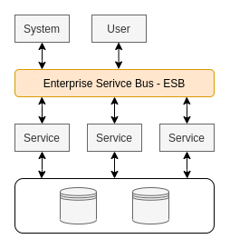
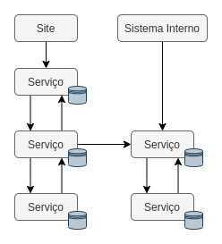
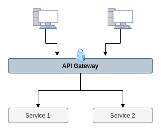
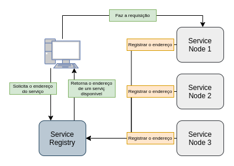
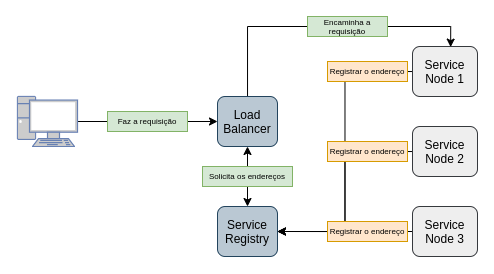

# **Fundamentos de arquitetura de software**

## **Introdução**
---

Um sistema é o resultado final de todos os produtos/serviços. Logo, a organização de um sistema, consiste nos componentes e em como eles se relacionam entre si e o ambiente, consiliados com a perpectiva de evolução do sistema.

Além disso, um sistema emgloba alguns pilares fundamentais:

- **Organização:** além de englobar a organização do software, este tambem contempla a organização dos processos que envolve o sistema.
- **Componentização:** consiste na junção dos componentes para criar um sistema, contudo um sistema não representa somente o software, mas sim todo o processo oraganizacional.
- **Relacionamento:** compreender como os componentes devem se comunicar entre si ou com meios externos, seja diretamente ou indiretamente.
- **Governança:** engloba a forma de como serão feitas as documentação, definir quem serão os times, as tecnologias utilizadas, entre outros.
- **Ambiente:** onde e como serão feitos os deploys da aplicação e quais ambientes serão definidos.
- **Projeto:** significa algo que tem começo meio e fim. Além disso, as definições de arquitetura de software devem ser um projeto a parte. 
- **Cultura:** como os times/pessoas tem diversos tem níveis de conhecimento diferentes, os arquitetus devem levantar informações relavantes para definir quais tecnnologias utilizar ressaltando os pontos positivos e negativos para conseguir tomar uma decisão adequada. Além disso, é necessário verificar o perfil da empresa e o qual a flexibilidade da mesma referente ao uso das tecnologias.

Outro ponto impotante que podemos ressaltar é o uso de frameworks, que nos auxilia a focar no objetivo final e "proporciona uma direção". Contudo, um framework não deve influenciar fortemente em uma decisão de arquitetura, por criar, algumas vezes, depências desnecessárias. 

Alguns recursos que podemos utilizar para nos auxiliar na definição de um arquitetura:
- **The TOGAF Standard - Version 9.2:** este contem conceitos e nomenclaturas definidas, além de nos fornecer uma visão geral de arquitetura: negócio, sistema de informaçao, tecnologias e planos de migração
- **ISO/IEC/IEEE 42010:** formaliza os fundamentos das areas de arquitetura de forma mais direta.

Outros pontos que podemos ressaltar referentes a decisões de arquitetura para garantir que as aplicações seram destruidas e criadas facilmente são:
- **Disco efêmoro:** o armazenamento da máquina temporário, isto é, quando a aplicação cair os dados em armazenados na memória da máquina são perdidos.
- **Servidor de aplicação vs Servidor de assets:** é importante separarmos arquivos estáticos da aplicação, possibilitanto que a aplicação fique mais leve e possibilitar backups sem afetar a aplicação.
- **Cache centralizada e Sessões centralizadas:** quando uma aplicação está distribuida e diversas máquinas, centralizar torna-se algo relvante pensando em custo e manutenção.

## **Escalabilidade**
---

Existe duas formas de um software ser escalado, isto é, aumentar os recursos para suprir as necessidades atuais e ou futuras:
- **Escalabilidade vertical:** consiste em aumentar os recursos computacionais das máquinas, para suportar a demanda.
- **Escalabilidade horizontal:** consiste em aumentar o número de aplicações, em máquinas diferentes, para suprir a demanda. Normalmente, esta abordagem tem a necessidade de um **Load Balancer** para distribuir as requisições entre as aplicações.

## **Sistemas Monolíticos**
---

Em sistemas monolíticos toda a sistema (aplicação) está centralizada em um unico projeto.

### **Vantagem**

- Facil manutenção, já que o relacionamento entre os componentes estão em um mesmo projeto.

### **Desvantagens**

- Alto acoplamento (dependendo muito do design do software)
- Tempo de deploy, já que o consiste em um único deploy para todo o sistema (dependendo do tamanho do projeto)

### **Indicativos para migrar de um monolíto para microsserviços**

- **Times grandes e/ou diversos times:** muitas pessoas modificando o mesmo local pode gerar algumas complicações.
- **Necessidade de escalar uma parte específica do sistema**.
- **Risco de deploy começa a ficar elevado**.
- **Necessidade de utilizar tecnologias diferentes**.

## **SOA: Arquitetura Orientada a Servicos**
---

Arquitetura na qual o sistema pode ser divido em serviços e estes são conectados a um ESB para prover a disponibilidade aos serviços. Além disso, recursos como banco de dados podem ser compartilhados entre os serviços.

Algumas situações podemos encontrar sistemas monilíticos acoplados a ESB, tornando-se um serviço.

### **Desvantagen**

- **Single point of failure:** como todo o sistema depende do ESB, caso o mesmo caia o sistema irá parar de funcionar.

## **Arquitetura baseada em Microsserviços**
---

Consiste em uma estrutura na qual os serviços são pequenos e com poucas responsabilidades, possibilitando a criação de serviços totalmente independentes. Devido a esta estrutura, microsserviços possui maior tolerância a falhas, pois case um serviço falhe o sistema em si não irá falhar complementamente, somente a parte que caiu em questão.

### **Pontos que devemos levar em consideração ao utilizarmos microsserviços**

- **Arquitetura complexa:** realizar o monitoramento, deploy e conectividade entre os serviços não é algo tão simples quanto um monolíto.
- **Custo mais elevado:** pois além do custo de diversas "máquinas" para os serviços deve ser incluso os custos dos diversos bancos de dados, além dos recursos de monitoramento.
- **Mais pessoas:** normalmente, empresas grandes, tem uma squad por serviço para conseguir mante-los e n~ao virar uma bagunça.
- **Problemas adicionais:** gerenciar rollbacks, transações, sincronia, entre outros, são facilmente resolvidos em monolítos, contudo em microsserviços as coisas mudam, pois uma operação pode começar em um serviço e terminar outro, ou ainda passar por diversos serviços.
- **Monitoramento complexo:** deve ser gerenciado diversas aplicações em tempo real para ser possível realizar previsões de problemas, principalmente problemas de trafego e/ou queda de serviços.

### **Componentização via serviços**

Componente é uma unidade de software independente que pode ser substituida e/ou atualizadas. Contudo temos que tomar ter atenção em alguns pontos:
- Chamadas externas são mais custosas do que chamadas locais.
- Cruzamento entre componentes pode se tornar complexas.
- Transações entre microsserviços são grandes desafios, pois temos que considerar monitoramento, além de considerar controle de transações (rollbacks, por exemplo).
- Mudanças bruscas em regras de negócios pode afetar diversos microsserviços.

### **Organização em torno do negócio**

Um projeto é baseado em um ou mais produtos com diferentes contextos. No qual, cada squad gerencia um produto, contudo, deve estar atento para não tornar uma bagunça. Além disso, cada produto pode ter mais de um serviço.

### **Smart endpoints & Dumb pipes**

Exposição de acessos seja por REST API e ou GRPC para comunicação externas ou internas entre serviços.Além disso, para comunicação assincrona normalemnte utiliza-se sistemas de mensagerias/filas, pois, além de ser assincrono, é uma alternativa para garantir a integridade dos dados trafegados.

### **Governança descentralizada**

Cada serviço ter suas próprias regras. Logo, a tecnologia é definida pelo contexto e/ou necessidade do problema. Contudo, os serviços deve ter interfaces/contratos indepentes para comunicação.

### **Automação de infraestrutura**

Os serviçoes devem ser colocados em produção rapidamente, caso contrário serão gerados gargalos desnecessários. Quando falamos de infraestrutura, os recursos mais comuns são:
- Cloud computing
- Testes automatizados
- CI/CD (continuos integration/continuos delivery)
- Load balancer / Autoscaling
- Replacement and upgradeability: quem nem percebe que o serviço foi substituido ou atualizado.

### **Desenhado para falhar**

Uma vez que um serviço falhe, o impacto no sistema deve ser o menor possível, mantendo o sistema de pé e somente com a parte que caiu inativa. Logo, mecanismos de *callback* e monitoramento devem ser implementados.

### **Design evolutivo**

Produtos bem definidos podem evoluir ou serem extintos por razões de negócio. Logo, um sistema deve ser modelado para que seja facilmente escalado e que gere o menor impacto possível após adicionar, remover ou atualizar suas *features*

### **API Gateway**

Uma API Gateway é um pattern, que em microsserviços, recebe todas as chamadas de API`s dos clientes e então as roteia para os microsserviços correspondentes. Além disso, em alguns casos ela também é responsável por realizar processos de autorizção, autenticação e outras checagens de segurança. 

### **Service Discovery**

Tem a finalidade de prover mecanismos de identificação dos serviços disponíveis e suas instâncias.

Ferramentas populares:
- Netflix Eureka
- Consul
- Etcd
- ZooKeeper

#### **Client Side**

#### **Server Side**

### **Comunicação entre microsserviços**

O processo de comunicação entre os serviços e/ou externo pode ser sincrona, por meio de Rest API`s, gRPC, entre outros, ou ainda assincrona, normalmente é utilizado filas/mensageria para estas situações. Normalmente em comunicações suncronas surgem atrasos de respostas que pode ser inconveniente para o usuário.

### **Dupla latência**

Consistente em considerar no tempo de resposta de uma requisição as chamadas internas dos serviços, já que uma requisição pode utilizar **N** serviços para ser concluida.

## **BFF - Backend for Frontend**
----

Consiste em criar uma camada se serviços para cada tipo dispositivos que está utilizando o serviço. Por exemplo, aplicações mobile, normalmente, precisa de menos informações para cumprir os requisitos de funcionalidade do que uma aplicação web, devido as limitações de hardware (ao menos, por enquanto).
